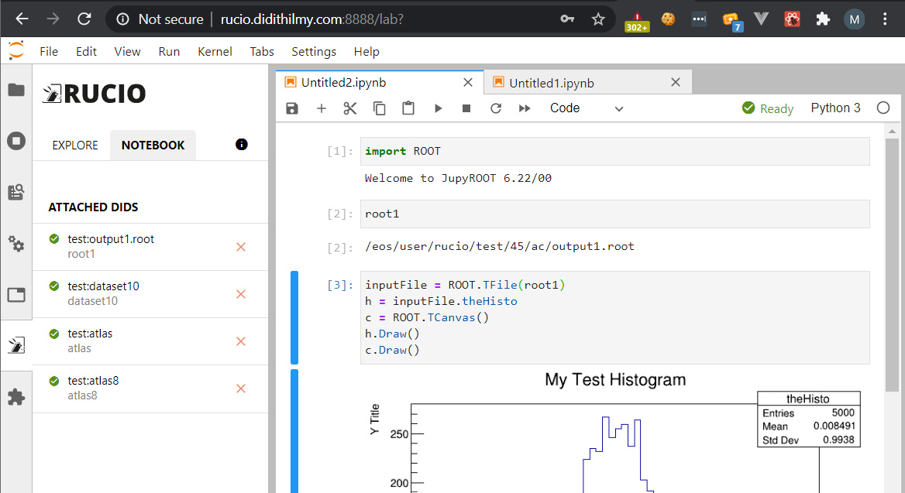

# Features Check

## Features
### Requests

#### From Meeting #0: May 25th
1. Communicate with Rucio via REST API.
2. Command Rucio to move a DID to a storage mounted to SWAN.
3. Fetch configuration from a remote location.

#### From Meeting #1: June 8th
4. Link DID to notebook via UI, allow users to specify the variable name.
5. Keep linked DID in the notebook metadata.
6. Resolve file paths from DID.
7. Inject resolved file paths via variables.
8. When the variable is accessed but the file hasn't been made available, show "Make Available" prompt.
9. Resolve paths for file DID, inject it in a string.
10. Resolve paths for container and dataset DIDs, inject them in an array of strings.
11. "Make Available" that works for both file and collection DIDs.
12. Show file size next to the Explore list item.

#### From Meeting #2: June 22nd
13. X.509 authentication, users specify path to cert files within the EOS home directory.

#### From Meeting #3: July 6th
14. Dockerfile with JupyterLab image for quick setup.
15. Configuration check at startup, show an error message if the extension cannot be activated.
16. Download mode for unauthenticated storages.

#### From Meeting #4: July 20th
17. Wildcard search feature, can be enabled from the configuration.
18. Show acknowledgement when settings are saved.

### Implementation Status
1. Implemented
2. Implemented as the "Make Available" action in Replica mode. Creates a replication rule to transfer requested files to a mounted RSE.
3. Implemented, see [CONFIGURATION.md](https://github.com/didithilmy/rucio-jupyterlab/blob/master/CONFIGURATION.md).
4. Implemented as "Add to Notebook" action in the Explore menu.   
5. Implemented
6. Implemented
7. Implemented, only works for IPython kernels for now.
8. Implemented
   1. In Python kernel, custom datatypes are used which are inherited from `str` and `list`. When the DID is not available yet, the extension raises an exception with a message "DID has not been made available".
   2. Originally, the idea was that when the exception is raised, the left panel extension shall prompt the user with "Make Available" button.
   3. The implementation differs from the plan. Instead of prompting the user when an exception is raised, the extension has a "Notebook" tab that shows all of the linked DIDs which includes the "Make Available" button.   
9.  Implemented
10. Implemented
11. Implemented
12. Implemented
13. Implemented, in the Settings menu users can specify the paths to X.509 cert files.
14. Implemented, see [Dockerfile](https://github.com/didithilmy/rucio-jupyterlab/blom/master/Dockerfile).
15. Implemented
16. Implemented, configurable from the configuration.
17. Implemented, configurable from the extension.
18. Implemented

### Additional Features
1. Dark theme support
2. Injection status button in the notebook toolbar   
3. Wildcard search selector (Collections, Dataset, Containers, Files, or Everything)
4. Userpass authentication
5. File picker on X.509 cert path textfield   
6. Collection DID file list   
7. Replication rule expiry configuration

### To discuss/to add
1. Rucio metadata cache expiry configuration.
2. "Clear cache" button in Settings.

## Checks
### Requests

#### From Meeting #3: July 6th
1. See if the injected variables work with PyROOT using `.root` files.

#### From Meeting #4: July 20th
2. See if the extension is installable on CERN OpenStack.

#### From Meeting #5: July 27th
3. See if the extension can be integrated with EOS.
4. See if the extension can be installed on SWAN.

### Check Status
1. Tried, worked.   
2. Tried using instance provided by Aris. Runs on Docker.
3. Will be tested by the SWAN team.
4. Will be tested by the SWAN team.