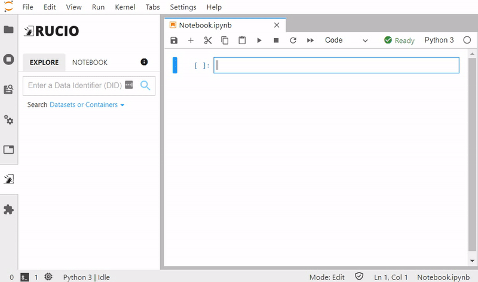
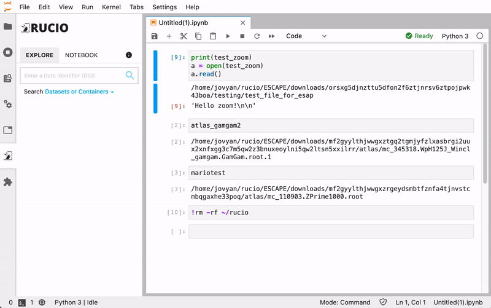

# Integration of Rucio in JupyterLab for SWAN
Google Summer of Code 2020 with CERN-HSF by Muhammad Aditya Hilmy <<mhilmy@hey.com>>

## Introduction
### Project Brief
This project aims to build a JupyterLab extension installable in SWAN and vanilla JupyterLab with the capability to integrate with CERN's exascale data management platform [Rucio](https://github.com/rucio/rucio). The extension abstracts the complex process of making data available for scientific analyses into a simple and intuitive one. It takes care of finding where the data is located, how to fetch it, downloads it into a folder, and making the file paths available in the notebook kernel as a Python variable.

Using this extension, the process of making the data available is as simple as online shopping. Simply find the data you're looking for, click on "Make Available," and finally click on "Add to Notebook" to attach the data to a notebook.

### Motivation
Rucio on itself is already an amazing tool, and SWAN is also an incredibly useful tool that enables scientists to perform analysis without the need of installing anything. However, these two systems are yet to be integrated. To perform analyses on Rucio-managed data using SWAN, one must manually duplicate the data into CERNBox, either by downloading and reuploading the data, or programatically using Rucio client. Both ways require some levels of Rucio knowledge, which is not ideal for users seeking to perform analysis using SWAN.

Additionally, the additional commands used to procure the data may clutter the notebook, taking attention away from the codes that actually matter.

## Work Results
### Rucio JupyterLab Extension
The extension's source code lives in [rucio/jupyterlab](https://github.com/rucio/jupyterlab). Documentations on how to install and use the package is available on the repo README.

#### Features
1. Browse Rucio data from the Lab sidebar
2. Replicate data with just one click
3. Resolves file path automagically
4. Inject path to notebook as a variable
5. Supports two methods of authentication (currently):
    1. Username & Password
    2. X.509 User Certificate
6. Supports two modes of operation:
    1. Replica mode: uses network-attached storage as a Rucio Storage Element (RSE), utilizes Rucio’s file transfer capability.
    2. Download mode: downloads data directly to the user’s directory using Rucio clients.
7. Remote configuration

#### Screenshots
*Because, what's a flex without some screenshots, right?*

### Issues and Pull Requests to Rucio
A couple of issues and pull requests to Rucio have been created and merged.
1. Issue [#3630](https://github.com/rucio/rucio/issues/3630)
2. Issue [#3871](https://github.com/rucio/rucio/issues/3871)
3. Issue [#3873](https://github.com/rucio/rucio/issues/3873)
4. Pull Request [#3631](https://github.com/rucio/rucio/pull/3631) and [#3632](https://github.com/rucio/rucio/pull/3632)
5. Pull Request [#3872](https://github.com/rucio/rucio/pull/3872)

## Future Developments
There are still exciting stuff that can be developed in the future.
1. More Kernel compatibility
   1. Octave, R, ROOT C++
2. More authentication methods
   1. OAuth/OpenID Connect
3. Share notebooks across JupyterLab installations
   1. Allows any JupyterLab instance to connect to publicly-accessible Rucio installations and their RSEs
   2. Fetches Rucio configuration on-the-fly, URL known from notebook metadata
4. (If you have other ideas, please let me know)

## Challenges and Takeaways
This is overall a fun and challenging project to do. I think the biggest challenge would be to familiarize myself with tools that are used almost exclusively in the scientific community. Tools like Rucio, XRootD, EOS are everything but familiar to me. I even had to delve into the world of Grid Computing just to implement a feature (which in most part is still a mystery to me).

For the details of the techical challenges that I had to face, and a description of how I dealt with it, take a look at my [project journal](https://github.com/didithilmy/gsoc2020/tree/master/journal).
