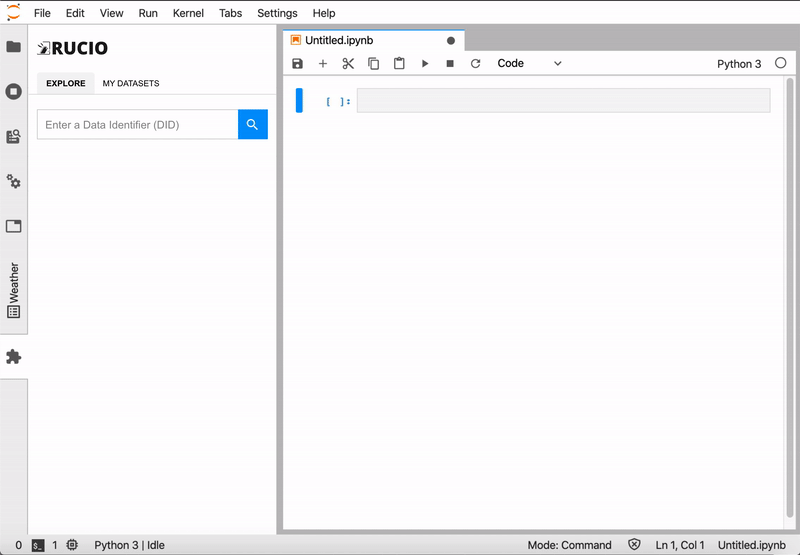

# Project Journal Ep. 1

## Objectives
- Learn more about Rucio and SWAN
- Clarify the problem to address
- Draft a solution alternative for the project
- Provision a development environment for the next 3 months
    - Deploy Rucio and SWAN
    - Add the EOS storage as a Rucio Storage Element

## Challenges
- Incomplete documentation for Rucio and EOS
    - Luckily, mentors answered some questions
- The outcome of the dev environment is to have the EOS storage added as an RSE and that Rucio is able to transfer a file to the EOS storage.
- I explored the XRootD protocol that is implemented by EOS and supported by Rucio
- EOS containers in the Docker setup is not exposed to the internet.
    - Resolved: `docker-compose.yml` is then modified to expose the ports.
- Tried to `mkdir /eos/docker/user/rucio` from `eos-client`, said I didn't have permission
    - Spent hours reading documentation about permission, heading nowhere.
    - Apparently, the `eos-mgm` container is installed with `eos-client` with root user.
    - Resolved: Did the `mkdir` from inside the container.
- Tried accessing `/eos/user/rucio` from inside the SWAN notebook, it said that operation was not permitted
    - Resolved: I set the mask of the folder to `777` (not really a wise choice but it's for development only)
- As a proof of concept, I used `xrdcp` to copy local file to EOS.
    - It failed. Weirdly enough, when I tried to list the directory from SWAN notebook, the file was listed. When I tried to `cat`, however, it said file does not exist.
    - Tried doing `xrdcp` with `--debug 3` option, it turned out that the MGM redirects the XRootD client to `eos-fts1.demonet` which is inaccessible from outside the Docker network.
    - Edited `docker-compose.yml` to have just a single node of `mgm mq fst`
      - It didn't work :(
    - Changed hostname to a publicly resolvable FQDN.
      - Also didn't work. Since it resolves to an external IP, it was considered unauthenticated and therefore resulted in the error message "no space left"
      - Tried to change both the FST and MGM domain from "demonet" to the publicly resolvable FQDN. Same "no space left" error
      - Tried to change all "demonet" domain to the publicly resolvable FQDN. Somehow the `/etc/docker/user` directory was not created.
      - When the hostname was changed back to `demonet`, the `user` directory returns. 
        - It turned out that the volumes must be pruned before changing domains.
      - I couldn't find a way to use hostname other than `demonet`. It's weird that I have replaced every "demonet" string literal in the github.com/cernbox/uboxed repository with `swan` and still failed.
    - Attempt to do PoC with `xrdcp` failed :(
 - Tried to put Rucio in the same Docker instance and network to make FST reachable from Rucio.
    - `run_tests_docker.sh -i` worked!
    - Added `root://eos-mgm.demonet` as an RSE. Worked!
    - Tried to upload a text file using `rucio upload`. The prompt stuck at `Starting new HTTPS connection (1): rucio:443`, but amazingly the file showed up when I accessed it from the SWAN notebook.
      - Resolved: the next day I reinstall the OS and Rucio as well as ScienceBox, put it in the same `demonet` network. It works! :)
- Tried to use Rucio REST API
  - Authentication worked.
  - Get replicas worked.
  - Add replicas returned HTTP 500 with an empty body.
- Tried using rucio CLI to add a replication rule to transfer the file into SWAN EOS storage.
  - Status always show "REPLICATING"
  - Perhaps an issue with FTS? How to manually run the FTS?
    - Resolved: use Daemons CLI
  - Status is now "STUCK". Transferring to `XRD2` works fine, though. 
  - Tried disabling XRootD TPC on FTS. Failed, FTS still uses TPC (3rd pull mode).
  - After reading the logfile of one of the EOS FST `eos-fst2`, it was discovered that the EOS storage had already accepted TPC. The problem was when the FST tried to pull the file from `XRD1`, `XRD1` denied the request due to authentication error.
    - Resolved: Disabled authentication on `XRD1`, `XRD2`, and `XRD3` by commenting out the `xrd.seclib` option in `/etc/xrootd/xrdrucio.cfg`
  - **Finally, a success!**

## Observations
- EOS MGM redirects client to an FST node, so the FST node must be accessible to the client.
- EOS MGM uses FST-reported hostname, which is retrieved from `hostname --fqdn` in every FST node.
- `xrdcp` from outside the Docker network fails, but from inside--albeit without authentication--can succeed.
- ~~Somehow Rucio and ScienceBox cannot coexist in the same Docker instance.~~
  - ~~Some ports conflict, but even after this is settled, Rucio still can't function properly. `run_tests_docker.sh` freezes when it uploads `file1`.~~
  - It might have something to do with the hostname of the OS. Previously I tried using a publicly-resolvable FQDN and it failed. I then didn't change the hostname and it works.
- EOS storage is somehow related to the domain name of the FST, MGM, and MQ.
- FTS3 uses Third-Party Copy to move files between XRootD nodes.

## Results

### Solution Alternative
- The extension will work in JupyterLab. The autentication details for Rucio and the RSEs are configurable from a configuration file to not bother the end users.
- To use the extension, users must already know the root DIDs in advance. The user will type in the DID of the file or container/dataset and hit "Search".
- The extension will then list the datasets and containers attached to the DID. Users can browse through the DID.
- Once the user found the file to retrieve, the user will be shown an option to download the file to his/her user directory via Rucio direct download, or transfer the file to a shared directory in EOS.
  - If the requested file exists in the user directory and/or shared directory in EOS, the extension will display the absolute path to access the file.
- The user can then access the file using standard methods.

Here is a mockup of what the extension would look like:

### Proof of Concept
I have successfully ran the following scenario:
1. Connect ScienceBox's EOS storage to Rucio as a Rucio Storage Element.
2. Upload a .txt file using `rucio upload` to `XRD1` RSE.
3. Create a replication rule using `rucio add-rule` to copy data from `XRD1` to the EOS RSE.
4. Get the status using `rucio list-rule`. It shows `REPLICATING`.
5. Execute `rucio-conveyor-submitter --run-once && rucio-conveyor-poller --run-once && rucio-conveyor-finisher --run-once` several times (to compensate for transfer delay)
6. Get the status using `rucio list-rule`. It shows `OK`.
7. Log on to SWAN, spawn a notebook, and listed `/eos/user/rucio`. There is a directory called `test`.
8. List the directory recursively until I find the file I uploaded previously to `XRD1`.

This proves that using Rucio to move a file to SWAN's EOS storage backend is possible. Note that some configurations in Rucio and ScienceBox are altered to disable authentication.