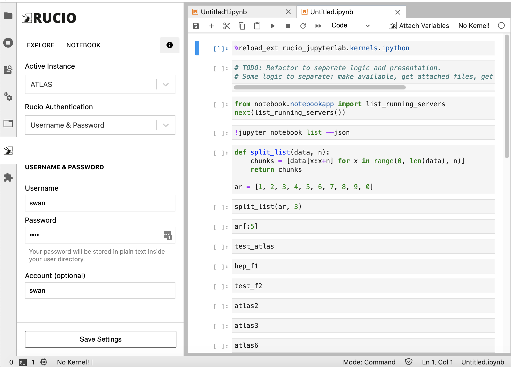
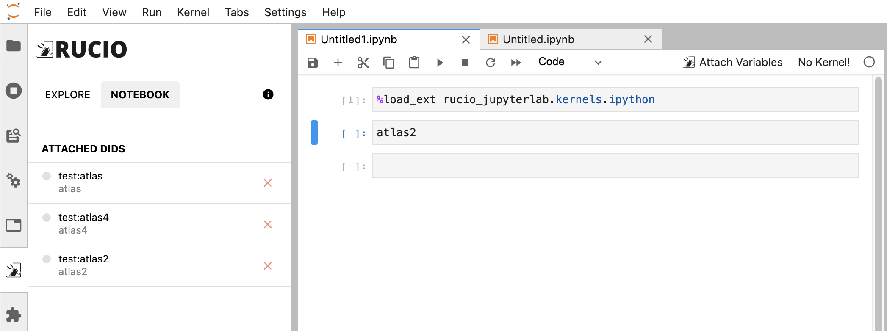
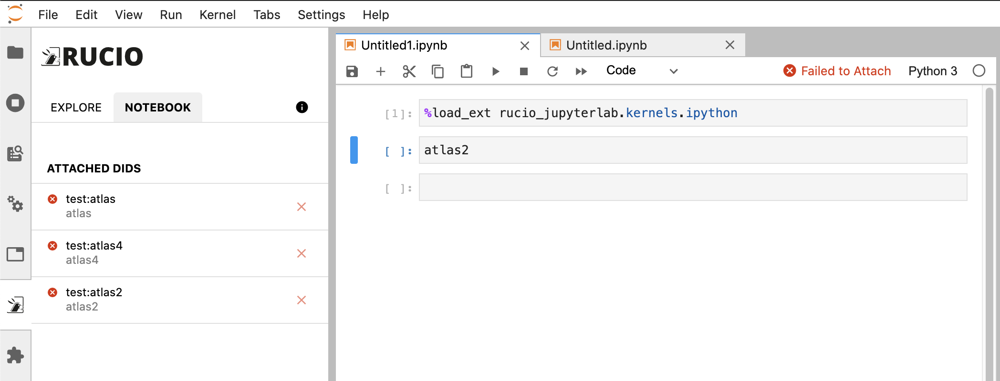

# Project Journal Ep. 6
**June 29th, 2020 - Jul 3rd, 2020**

## Objectives
- Move authentication config from static config file to user-configurable.
- Add a button to allow users to manually inject the variables.

## Challenges
- It's unclear when to inject the variables into the notebook.
  - When kernel attached? When notebook is focused?
  - What happens when kernel is restarted? Shutdown? They result in different behaviors.
  - Must listen to different events which could be overlapping.
    - A kernel restart won't trigger kernel attach, but shutting down and starting it again does.
    - If instead it attaches to on kernel started, somehow (sometimes) the receiving comm hasn't been setup.
  - Current version can't guarantee that injected variables won't be reinjected.
    - In some cases, the same variables can be injected twice in a row.
  - The fix for this is to have a button that can be manually clicked in case the variable is unavailable
- Integrating React and non-React code is challenging.
  - They have different state store system.
  - Could easily result in spaghetti code, potentially having race conditions.
    - I tried to refactor the codes for injecting the variable, better than the previous one, but still somewhat confusing.
  - An adapter to synchronize JupyterLab events and React state is required.
    - This adapter is stateful, has a potential to be inconsistent at times, and possibly a memory leak. More research and tests are needed.

## Observations
- Sudden React props change could be problematic when that changing props is used to listen to change in other events.
  - Example: `activeNotebookId` is used to listen to `resolverStatus`. `activeNotebookId` can change, but the listener could be declared just before `activeNotebookId` changes, causing states to be inconsistent.
  - A quick fix would be to use `setTimeout`, but that could cause even more race problems.

## Results
- Added settings for configuring auth params 
- Refactored NotebookListener to reduce spaghetti code (not eliminating it, though)
- Add a widget in Notebook to show user whether the variable is ready to be used in the notebook or not. The widget can be clicked to manually invoke variable injection process. 
  - The Notebook panel is now equipped with an icon indicating the status of each variables:
    - Not injected (grey)
    - Resolving (orange)
    - Pending injection (lime green)
    - Injected (green)
    - Failed (red)
    - Replicating (orange)
  - Screenshots   